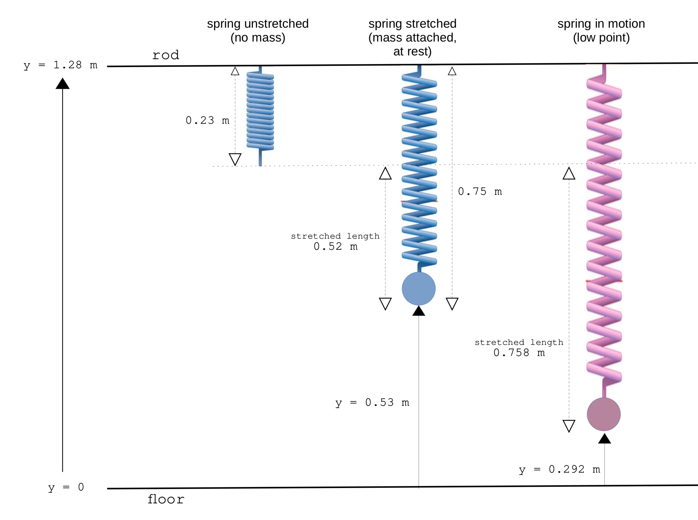

```{r setup, include=FALSE}
knitr::opts_chunk$set(echo = TRUE)
library(ggplot2)
library(dplyr)
library(gridExtra)
```

\ 

This doc runs through some data crunching and visualisation for the last experiment in lab 5, **Gravity + Spring**. Note the data I use here is from the file `exp3data.csv`, which is raw data exported from Capstone for experiment 3 specifically. It's not the same as the data given in the `data.xlsx` file in the main folder, so please don't use them interchangeably. All the code I've written in this doc for parsing and plotting the data is written in R. 

\ 

The experiment has the following setup:

- height of rod above the ground: 1.28 m
- length of unstretched spring (when no mass attached): 0.23 m
- length of stretched spring (after attaching the mass): 0.75 m
- note the $y$-coordinate is always measured from the floor up (the ground level is $y = 0$)

\ 

A diagram of the setup:

```{r, echo=F}

```
\ 

First load the data and preview the first few rows:

```{r}
# load data
experimentData = read.csv("exp3data.csv")

# print the first few rows of the dataset
head(experimentData)
```
\ 

Now make some plots of position/velocity/acceleration vs time:

```{r, warning=F, message=F}
# position vs time plot
plot_pos = ggplot(data = experimentData, aes(x = time, y = position)) +
  geom_point(color = "red") +
  scale_y_continuous(n.breaks = 10, limits = c(0.2,0.85)) +
  theme_bw()

# velocity vs time plot
plot_vel = ggplot(data = experimentData, aes(x = time, y = velocity)) +
  geom_point(color = "blue") +
  scale_y_continuous(n.breaks = 10, limits = c(-1.3,1.3)) +
  theme_bw()

# acceleration vs time plot
plot_acc = ggplot(data = experimentData, aes(x = time, y = acceleration)) +
  geom_point(color = "orange") +
  scale_y_continuous(n.breaks = 10, limits = c(-5,5)) +
  theme_bw()

# arrange all three plots on one grid
posVelAccPlots = grid.arrange(plot_pos, plot_vel, plot_acc, ncol = 1)  
```
\ 

Next let's find the value of the spring constant, $k$. As stated at the beginning, the length of the unstretched spring is 0.23 m. When adding the mass it stretches to 0.75 m. We can compute $k$ by equating the forces when the mass is in equilibrium:

\begin{aligned}
  F_{\text{gravity}} &= F_{\text{spring}} \\ 
  mg &= ky \\ 
  \therefore k &= \frac{mg}{y}
\end{aligned}

where $y$ is the extension of the spring from its original unstretched length. Below are some computations for finding $k$:

```{r}
springUnstretchedLength = 0.230 # metres
springStretchedLength = 0.750 # metres
mass = 0.5 # kilograms
G = 9.81 # gravitational constant
k = (mass * G) / (springStretchedLength - springUnstretchedLength) # spring constant (N/m)
print(k)
```

So $k$ = 9.433 N/m. Brilliant. 

\ 

Now let's compute the various energies of the system. The raw data presented above has info on the position, velocity, and acceleration of the mass at 256 time points. There are three forms of energy we're interested in: kinetic energy, gravitational potential energy, and elastic potential energy.  

**Kinetic energy:**

$$KE = \frac 12 mv^2$$
where $v$ is the velocity. 

**Gravitational potential energy:**

$$GPE = mgh$$

where $h$ is the height. We can just use the position (since the position variable measures the distance of the mass from the floor which is the same as  height). 

**Elastic potential energy:**

$$EPE = \frac 12 k y^2$$
where $y$ is the extension of the spring. It's important to note that the extension of the spring is measured from its original, unstretched length, *not* the equilibrium point. 

\ 

Anyway, the code below adds four columns to the raw data, computing the kinetic energy, gravitational potential energy, elastic energy, and total energy, at each of the 256 time points: 

```{r}
# add columns to table for KE, GPE, EPE, and TE
experimentData = experimentData %>%
  mutate(kineticEnergy = 0.5 * mass * (abs(velocity))^2, 
         gravPotEnergy = mass * G * position, 
         elasticPotEnergy = 0.5 * k * (abs(1.28 - position - springUnstretchedLength))^2, 
         totalEnergy = kineticEnergy + gravPotEnergy + elasticPotEnergy)
```

\ 

Here's a sneak peek of the modified dataset with the new columns giving the energies of the system:

```{r}
head(experimentData)
```
\  

Now let's make some plots of energy and compare them to the position vs time graph: 

```{r, warning=F}
plot_totalEnergy = ggplot(data = experimentData, aes(x = time, y = totalEnergy)) +
  geom_point() +
  scale_y_continuous(n.breaks = 10, limits = c(3.5,4.5)) +
  theme_bw()

plot_allEnergy = ggplot(data = experimentData) +
  geom_point(aes(x = time, y = totalEnergy), color = 'black') +
  geom_point(aes(x = time, y = kineticEnergy), color = 'magenta') +
  geom_point(aes(x = time, y = elasticPotEnergy), color = 'blue') +
  geom_point(aes(x = time, y = gravPotEnergy), color = 'green') +
  scale_y_continuous(n.breaks = 10, limits = c(0, 4.5)) +
  ylab('energy') +
  theme_bw()

grid.arrange(plot_pos, plot_allEnergy, ncol = 1)
```
\ 

Kinetic energy is indicated in magenta, elastic potential energy is indicated in blue, gravitational potential energy is indicated in green, and the total energy is indicated in black. See how the three forms of energy are exchanged in the system during its motion. You can see total energy is conserved (roughly speaking). Heck yeah. 

\ 

\ 


