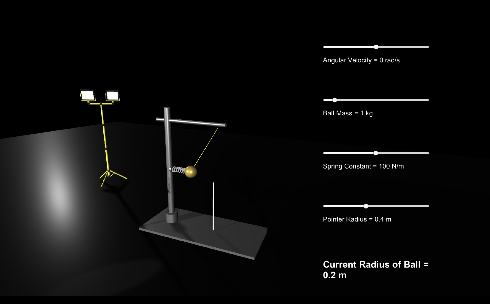
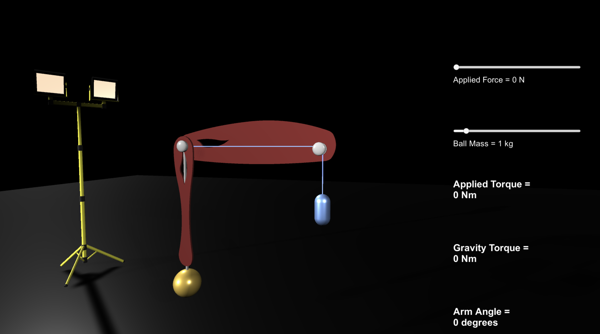

# gp1lab

Some experimental course material. 

- Email: [vabe@nyu.edu](mailto:vabe@nyu.edu)
- [Syllabus](https://github.com/vaabe/phys12/blob/main/info/syllabus.pdf)
- [Dropbox](https://www.dropbox.com/sh/0wpkybfyt7anajn/AAA3nMDkRIC0Ymietxrakoqya?dl=0)

| Date | Lab |
| --- | --- |
| Sep 16-17 | Policy Review |
| Sep 23-24 | Motion 1 |
| Sep 30-Oct 1 | Motion 2 |
| Oct 7-8 | Newton's 2nd Law |
| Oct 14-15 | Work-Energy |
| Oct 21-22 | Conservation of Energy |
| Oct 28-29 | Collisions in 1D |
| Nov 4-5 | Ballistic Pendulum |
| Nov 11-12 | Centripetal Force |
| Nov 18-19 | Human Arm |
| Nov 25-26 |  |
| Dec 2-3 | Absolute Zero |

